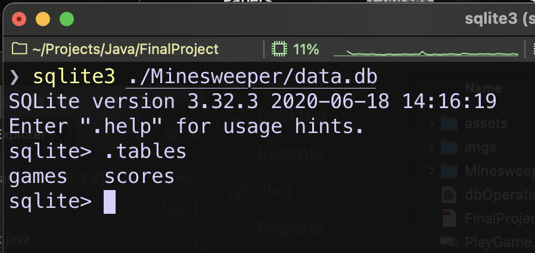

# Final Project: Minesweeper

Name: Zhiying Cui

NetID: zc2191

## Tasks

- Build the game functionally
- Load and save previous games

- Create a 1000 second timer that counts down to zero, and the remaining time on the counter is the score. 
- When the counter hits zero, you lose, just as if you had hit a mine

The architecture for saving and loading game looks like this:


##Architecture 

- Game UML diagram


- Server UML diagram


## Steps to start the game

- Start the server: run **DataServer.java** in **server** package
- Run the game: run **MinesweeperMain.java** in **game** package

Noted: You can comment out line 22 in **MinesweeperMain.java** and more easily run or test the whole game. However, it is not the correct process in practical.

## Basic features

- Server console to record the execution


- Game panel


- Game menu


- Play the game


- Multi-threads


- Close the game on the client: Once there are no active windows, the game will be ended automatically
- Close the server: Close the window
- Find more in the screen recording **PlayGame.mov**

## Connect to the server

- Consider the speed of playing the game online, here I use UDP connection to tranfer the data
- The operations between the client and the server are recognized by command keyword, such that

```java
private static final String MARK = "#"; // seperator
private final String cmdSaveGame = "save";
private final String cmdLoadGame = "load";
private final String cmdSaveScore = "score";
private final String cmdShowScore = "showscore";
private final String cmdShowGame = "showgame";
```

- In general, the client send data to the server in the following form

```
<cmdKeyword>#<data>
```

- The server only send the target data to the client

```
<data>
```

- Game scores are automatically sent to the server every time the game is ended
- Game state is serialized into a **String data** and sent to the server when **Save** menu item is executed. When the player loads a game, the server sends back the required  **String data**. Then, the client will deserialize the data into a new object
- Each key values for the saved game are seperated by distinct marks in the **String data**, such as "%", "&", ";", "," etc. One **String data** example:

```
999%false&false&10,1,0,0;10,9,0,1;10,9,0,2;10,3,0,3;10,9,0,4;10,3,0,5;10,2,0,6;10,3,0,7;10,9,0,8;10,1,0,9;10,0,0,10;10,0,0,11;10,0,0,12;10,0,0,13;10,0,0,14;10,0,0,15;10,2,1,0;10,3,1,1;10,3,1,2;10,3,1,3;10,9,1,4;10,3,1,5;10,9,1,6;10,9,1,7;10,2,1,8;10,1,1,9;10,0,1,10;10,1,1,11;10,1,1,12;10,1,1,13;10,0,1,14;10,0,1,15;10,1,2,0;10,9,2,1;10,1,2,2;10,1,2,3;10,2,2,4;10,3,2,5;10,3,2,6;10,2,2,7;10,1,2,8;10,0,2,9;10,0,2,10;10,1,2,11;10,9,2,12;10,1,2,13;10,0,2,14;10,0,2,15;10,2,3,0;10,2,3,1;10,3,3,2;10,1,3,3;10,2,3,4;10,9,3,5;10,1,3,6;10,0,3,7;10,0,3,8;10,0,3,9;10,0,3,10;10,1,3,11;10,1,3,12;10,1,3,13;10,0,3,14;10,0,3,15;10,1,4,0;10,9,4,1;10,4,4,2;10,9,4,3;10,3,4,4;10,1,4,5;10,2,4,6;10,1,4,7;10,1,4,8;10,1,4,9;10,2,4,10;10,2,4,11;10,1,4,12;10,0,4,13;10,0,4,14;10,0,4,15;10,2,5,0;10,3,5,1;10,9,5,2;10,9,5,3;10,2,5,4;10,0,5,5;10,2,5,6;10,9,5,7;10,2,5,8;10,1,5,9;10,9,5,10;10,9,5,11;10,2,5,12;10,1,5,13;10,0,5,14;10,0,5,15;10,1,6,0;10,9,6,1;10,4,6,2;10,4,6,3;10,3,6,4;10,1,6,5;10,3,6,6;10,9,6,7;10,3,6,8;10,1,6,9;10,2,6,10;10,4,6,11;10,9,6,12;10,2,6,13;10,0,6,14;10,0,6,15;10,1,7,0;10,1,7,1;10,2,7,2;10,9,7,3;10,9,7,4;10,2,7,5;10,4,7,6;10,9,7,7;10,3,7,8;10,0,7,9;10,0,7,10;10,2,7,11;10,9,7,12;10,2,7,13;10,0,7,14;10,0,7,15;10,0,8,0;10,0,8,1;10,2,8,2;10,3,8,3;10,3,8,4;10,2,8,5;10,9,8,6;10,9,8,7;10,2,8,8;10,0,8,9;10,0,8,10;10,1,8,11;10,1,8,12;10,1,8,13;10,0,8,14;10,0,8,15;10,0,9,0;10,0,9,1;10,1,9,2;10,9,9,3;10,1,9,4;10,1,9,5;10,2,9,6;10,2,9,7;10,1,9,8;10,1,9,9;10,1,9,10;10,1,9,11;10,0,9,12;10,1,9,13;10,1,9,14;10,1,9,15;10,0,10,0;10,0,10,1;10,2,10,2;10,2,10,3;10,2,10,4;10,1,10,5;10,1,10,6;10,1,10,7;10,1,10,8;10,2,10,9;10,9,10,10;10,1,10,11;10,0,10,12;10,1,10,13;10,9,10,14;10,1,10,15;10,0,11,0;10,1,11,1;10,2,11,2;10,9,11,3;10,3,11,4;10,3,11,5;10,9,11,6;10,1,11,7;10,1,11,8;10,9,11,9;10,2,11,10;10,1,11,11;10,0,11,12;10,1,11,13;10,1,11,14;10,1,11,15;10,0,12,0;10,2,12,1;10,9,12,2;10,4,12,3;10,9,12,4;10,9,12,5;10,4,12,6;10,3,12,7;10,2,12,8;10,1,12,9;10,1,12,10;10,0,12,11;10,0,12,12;10,0,12,13;10,0,12,14;10,0,12,15;10,0,13,0;10,2,13,1;10,9,13,2;10,4,13,3;10,3,13,4;10,4,13,5;10,9,13,6;10,9,13,7;10,1,13,8;10,0,13,9;10,0,13,10;10,0,13,11;10,0,13,12;10,1,13,13;10,1,13,14;10,1,13,15;10,0,14,0;10,1,14,1;10,1,14,2;10,2,14,3;10,9,14,4;10,2,14,5;10,2,14,6;10,2,14,7;10,1,14,8;10,0,14,9;10,0,14,10;10,0,14,11;10,0,14,12;10,1,14,13;10,9,14,14;10,1,14,15;10,0,15,0;10,0,15,1;10,0,15,2;10,1,15,3;10,1,15,4;10,1,15,5;10,0,15,6;10,0,15,7;10,0,15,8;10,0,15,9;10,0,15,10;10,0,15,11;10,0,15,12;10,1,15,13;10,1,15,14;10,1,15,15
```


## Connect to the database

- There are two tables in the **data.db** at the server side



- Table **games**


- Table **scores**


- Only 7 the most recent game are saved in the table **games**
- Only five highest records are saved in the table **scores**
- Some SQL commands

```sqlite
-- create table scores
CREATE TABLE scores (
	time TEXT NOT NULL,
	score INTEGER NOT NULL
);

-- select top five scores
SELECT score from scores ORDER BY score DESC LIMIT 5;

-- delete line with smallest scores
DELETE FROM scores WHERE score = (SELECT MIN(score) FROM scores);

-- delete table scores
DROP TABLE scores;

-- create table games
CREATE TABLE games (
	time TEXT NOT NULL,
    ip TEXT NOT NULL,
	data INTEGER NOT NULL
);

-- delete table games
DROP TABLE games;
```

## Other features

- Add the shortcuts to quickly execute the menu item
- Load the selected game. The user can find the desired game by the time stamp, hostname and IP